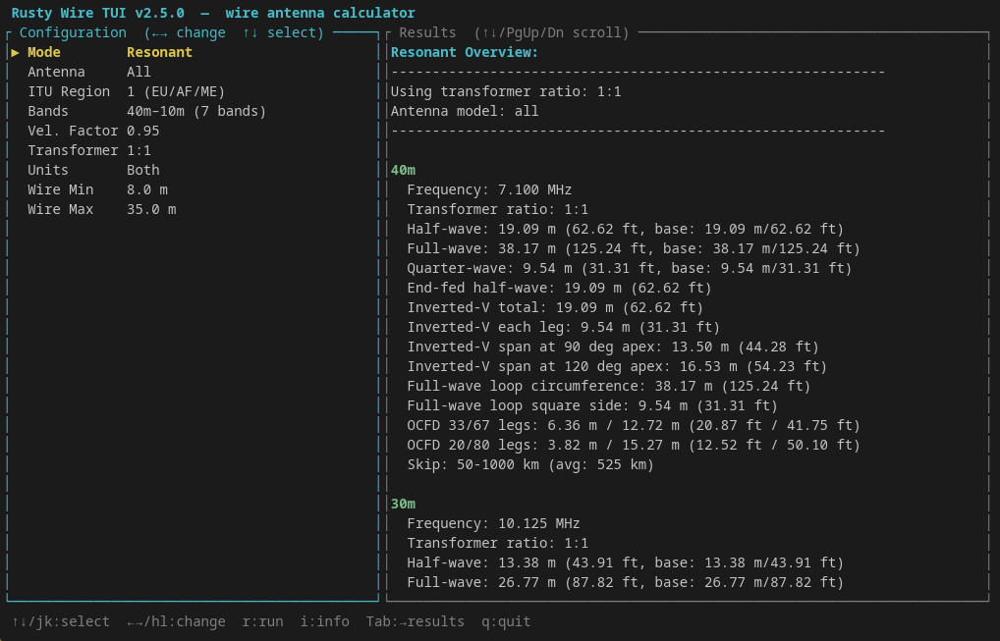
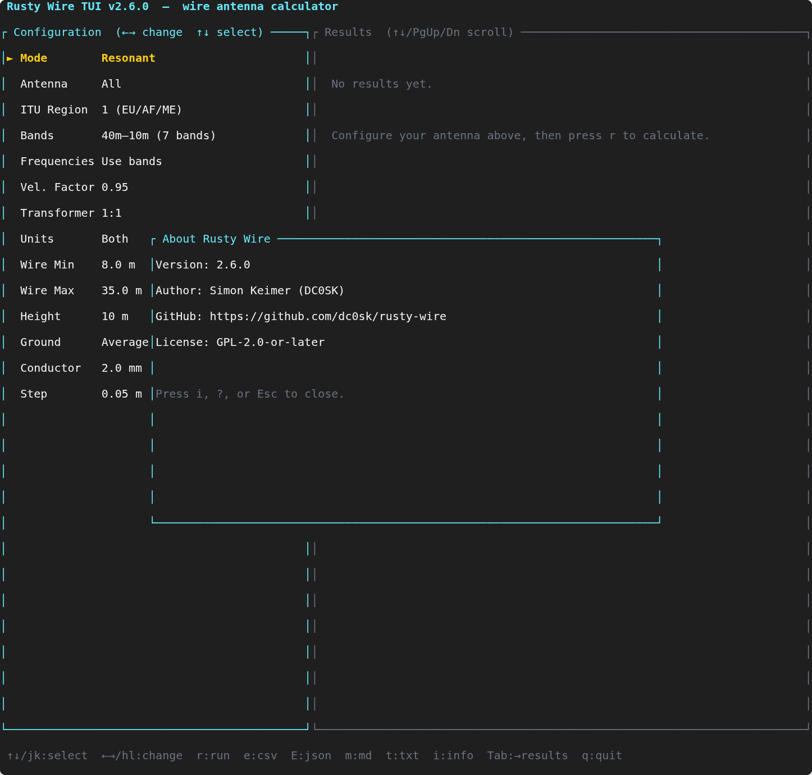

# Rusty Wire


> Wire-antenna planning for ham radio operators — fast, precise, and scriptable.

---

If Rusty Wire is useful to you, consider supporting its development:

[](https://www.paypal.com/donate/?hosted_button_id=WY9U4MQ3ZAQWC)

---

Rusty Wire computes resonant and non-resonant wire lengths across ITU-region-aware
amateur and shortwave bands. It covers six antenna models, recommends transformers
automatically, and fits comfortably into shell scripts as well as interactive
planning sessions.

**2.17.1: man page, macOS `.pkg` + Windows `.msi` installers, custom band entries in `bands.toml` · 3.x roadmap: desktop GUI (`iced`)**

---

## Features

### Antenna models

| Model | `--antenna` flag | Key output |
|---|---|---|
| Half-wave dipole | `dipole` | Half-wave length, per-leg |
| Inverted-V | `inverted-v` | Total and per-leg, 90°/120° apex span |
| End-fed half-wave | `efhw` | Total EFHW wire length |
| Full-wave loop | `loop` | Circumference and square-side estimate |
| Off-center-fed dipole | `ocfd` | 33/67 and 20/80 leg splits, optimised feedpoint |
| Trap dipole | `trap-dipole` | Trap total/per-element plus build guidance notes |

Omit `--antenna` to show all six models at once.

### Calculation modes

**Resonant** (default) — per-band resonant lengths, in-window harmonic analysis,
shared compromise lengths across multiple bands.

**Non-resonant** — finds the single best wire length that minimises proximity
to resonance across all selected bands, with full local-optima listing and
equal-tie support.

### Output and scripting

- `--quiet` — suppresses the results table; non-resonant mode prints one compact
  recommendation line, resonant mode exits silently. Designed for shell scripting.
- `--verbose` — print the resolved run configuration before executing.
- `--dry-run` — validate inputs and print the resolved run without calculating or exporting.
- `--bands-preset <name>` — load a named band set from a TOML config file.
- `--bands-config <path>` — override preset file path; otherwise Rusty Wire auto-discovers `~/.config/rusty-wire/bands.toml` first, then `./bands.toml`.
- `--advise` — print ranked wire + balun/unun candidates with efficiency-style metrics.
- `--validate-with-fnec` — when used with `--advise`, run optional cross-tool validation via `fnec-rust` (if available in `PATH`) and print per-candidate status notes.
- `--fnec-pass-max-mismatch` and `--fnec-reject-min-mismatch` — configure pass/warn/reject thresholds for advise validation when `--validate-with-fnec` is enabled.
- Advise exports (`--advise --export ...`) now include `validated`, `validation_status`, and `validation_note` fields in CSV/JSON/Markdown/TXT output.
- `--freq <MHz>` — compute wire lengths for a single explicit frequency without
  touching the band database.
- `--freq-list <f1,f2,...>` — compute wire lengths for multiple explicit frequencies
  in a single invocation; each produces its own labelled result.
- `--velocity-sweep <v1,v2,...>` — run the same configuration at multiple
  velocity factors and print a side-by-side comparison table.
- `--height 7|10|12` — select standard antenna height model (meters) used for
  height-aware skip-distance estimates.
- `--ground poor|average|good` — select ground-class model used for
  skip-distance scaling (default: `average`).
- `--conductor-mm <1.0..4.0>` — set conductor diameter in millimeters for
  first-order impedance/length correction (default: `2.0`).
- `--step <meters>` — control non-resonant search resolution (default 0.05 m).
- `--velocity <value>` — velocity factor from 0.50 to 1.00 (default 0.95).
- `--transformer recommended|1:1|1:4|1:9|1:49|1:56|...` — auto-resolved per
  mode and antenna model by default.
- `--units m|ft|both` — metric, imperial, or both systems in one run.
- `--export csv,json,markdown,txt,yaml,html` — export any combination of formats.

### Bands and regions

- ITU Region-aware band tables (Region 1 default; `--region 1|2|3`).
- Named-band selection and ranges: `--bands 40m,20m,10m-15m`.
- `--list-bands` to inspect the full band table for any region.
- In the TUI, changing ITU region immediately refreshes built-in band preset labels, reapplies the active preset for the new region, and updates the custom-band checklist overlay in place.

---

## Installation

### Pre-built packages (recommended)

Download the latest release from the [GitHub Releases page](https://github.com/dc0sk/rusty-wire/releases).

| Platform | Package | Notes |
|----------|---------|-------|
| Linux x86\_64 | `rusty-wire-<ver>-x86_64-linux.tar.gz` | Extract and copy binary to `PATH` |
| Linux aarch64 | `rusty-wire-<ver>-aarch64-linux.tar.gz` | Raspberry Pi 4/5 and other ARM64 |
| Linux (Debian/Ubuntu) | `rusty-wire_<ver>_amd64.deb` / `_arm64.deb` | `sudo dpkg -i rusty-wire_*.deb` |
| macOS x86\_64 | `rusty-wire-<ver>-x86_64-macos.pkg` | Double-click or `sudo installer -pkg ... -target /` |
| macOS aarch64 | `rusty-wire-<ver>-aarch64-macos.pkg` | Apple Silicon |
| Windows x86\_64 | `rusty-wire-<ver>-x86_64-windows.msi` | Double-click — installs to `Program Files` and adds to PATH |

The macOS `.pkg` and Linux `.deb` installers include the man page (`man rusty-wire` works after install).

### Build from source

```bash
# Build a release binary
cargo build --release

# Show all options
./target/release/rusty-wire --help

# Interactive planning session
./target/release/rusty-wire --interactive

# Launch the TUI (full-screen mode)
./target/release/rusty-wire --interactive

# During development
cargo run --bin rusty-wire -- [OPTIONS]
```

---

## TUI Mode (Full-Screen Terminal Interface)

Rusty Wire includes a keyboard-driven Text User Interface (`--tui` or `-t` flag) with ratatui:

```bash
rusty-wire --tui
```

### TUI Features

- **Real-time configuration**: Adjust band presets, antenna models, mode, velocity factor, height, and ground class
- **Live recalculation**: Results update as you modify settings (with debounce for non-resonant search)
- **Band selection**: Cycle through named presets or open a checklist to pick custom bands
- **Export formats**: Press `e`/`E`/`m`/`t`/`y`/`H` to export results as CSV/JSON/Markdown/plain text/YAML/HTML; an export-preview overlay shows the output before writing.
- **Collapsible result panels**: `[`/`]` to move the band cursor, `Space` to collapse/expand the highlighted band.
- **Saved sessions**: press `S` to save the current `AppConfig` under a name; `O` opens a picker to load (`Enter`) or delete (`d`) a session. Stored in `~/.config/rusty-wire/sessions.toml`.
- **Visual highlighting**: recommended transformer ratio is shown in green/bold; bands skipped by the user are shown in yellow.
- **Advise panel**: Press `a` to toggle ranked balun/unun candidates with efficiency estimates
- **Keyboard navigation**: Arrow keys or vim keys (`hjkl`) to navigate; Tab to switch focus between config and results
- **Persistent preferences**: Press `s` to save current settings as defaults (`~/.config/rusty-wire/config.toml`)
- **Project info**: Press `i` or `?` to view metadata and keybindings

### Keybindings Reference

| Key | Action |
|-----|--------|
| `↑` / `k` | Select previous config field |
| `↓` / `j` | Select next config field |
| `←` / `h` | Decrease field value |
| `→` / `l` | Increase field value |
| `r` / `Enter` | Run calculation |
| `e` | Export CSV (preview first) |
| `E` | Export JSON (preview first) |
| `m` | Export Markdown (preview first) |
| `t` | Export plain text (preview first) |
| `y` | Export YAML (preview first) |
| `H` | Export HTML (preview first) |
| `[` / `]` | Move band cursor in the results panel |
| `Space` | Collapse / expand the highlighted band |
| `s` | Save preferences |
| `S` | Save current configuration as a named session |
| `O` | Open the saved-session picker (Enter: load, `d`: delete) |
| `a` | Toggle advise panel |
| `i` / `?` | Toggle project info |
| `Tab` | Toggle focus (config ↔ results) |
| `PgUp` / `PgDn` | Scroll results |
| `q` / `Esc` | Quit (closes overlays first) |
| `Ctrl-C` | Quit |

---

## Examples

**Resonant lengths for 40 m and 20 m (all antenna models):**
```bash
rusty-wire --bands 40m,20m --velocity 0.95
```

**EFHW planning for 40 m / 20 m with transformer auto-selection:**
```bash
rusty-wire --mode resonant --bands 40m,20m --antenna efhw --transformer recommended
```

**OCFD resonant analysis:**
```bash
rusty-wire --mode resonant --bands 40m,20m --antenna ocfd --height 10 --ground average --conductor-mm 2.5
```

**Find the best non-resonant wire for a 10–35 m garden:**
```bash
rusty-wire --mode non-resonant --bands 40m,20m,15m,10m --wire-min 10 --wire-max 35
```

**Same run, imperial window, metric+imperial output:**
```bash
rusty-wire --mode non-resonant --bands 40m,20m,15m --wire-min-ft 30 --wire-max-ft 90 --units both
```

**Single explicit frequency (no band selection needed):**
```bash
rusty-wire --freq 7.074 --antenna dipole
```

**Multiple explicit frequencies in one run:**
```bash
rusty-wire --freq-list 3.650,7.074,14.074 --antenna dipole
```

**Compare three velocity factors side by side:**
```bash
rusty-wire --mode non-resonant --bands 40m,20m --wire-min 10 --wire-max 35 \
  --velocity-sweep 0.85,0.95,1.00
```

**Use a named custom band preset from `bands.toml`:**
```toml
[presets]
portable = ["40m", "20m", "15m", "10m"]
fieldday = ["80m", "40m", "20m", "15m", "10m"]
```

```bash
rusty-wire --bands-preset portable
rusty-wire --bands-preset fieldday --bands-config ./profiles/bands.toml
```

**Get ranked advise candidates (wire + balun/unun):**
```bash
rusty-wire --advise --bands 40m,20m,15m --antenna efhw
rusty-wire --advise --bands-preset portable --bands-config ./profiles/bands.toml
# Export advise report as Markdown
rusty-wire --advise --bands 40m,20m --antenna efhw --export markdown --output advise.md
```

**Script-friendly one-liner (non-resonant recommendation only):**
```bash
rusty-wire --mode non-resonant --bands 40m,20m --wire-min 10 --wire-max 35 --quiet
# → e.g.:  20.35 m  (66.76 ft)
```

**Inspect the resolved run without executing it:**
```bash
rusty-wire --mode non-resonant --bands 40m,20m --wire-min 10 --wire-max 35 --dry-run
rusty-wire --bands 40m --verbose
```

**Export to CSV and Markdown for a field notebook:**
```bash
rusty-wire --mode non-resonant --bands 20m,15m,10m --wire-min 8 --wire-max 25 \
  --export csv,markdown --output my-antenna
```

**List all bands for ITU Region 2:**
```bash
rusty-wire --list-bands --region 2
```

For a complete option reference see [docs/cli-guide.md](docs/cli-guide.md).
For formulas and optimizer objective functions see [docs/math.md](docs/math.md).

---

## Documentation

| Document | Contents |
|---|---|
| [docs/man/rusty-wire.1.md](docs/man/rusty-wire.1.md) | Man page — full CLI reference (bundled in release packages) |
| [docs/cli-guide.md](docs/cli-guide.md) | Full option reference and worked examples |
| [docs/math.md](docs/math.md) | Formula definitions and optimizer objective functions (KaTeX) |
| [docs/nec-calibration.md](docs/nec-calibration.md) | Workflow for fitting practical-model constants from NEC/reference sweeps |
| [docs/architecture.md](docs/architecture.md) | Module design, execution flow, app-layer API |
| [docs/roadmap.md](docs/roadmap.md) | Milestone plan (2.x TUI, 3.x GUI) |
| [docs/backlog.md](docs/backlog.md) | Unconfirmed ideas under consideration |
| [docs/tui-screenshots.md](docs/tui-screenshots.md) | Canonical TUI screenshot capture and placement checklist |
| [docs/testing.md](docs/testing.md) | Test strategy and regression scripts |
| [docs/CHANGELOG.md](docs/CHANGELOG.md) | Full release history |

---

## Testing

```bash
# Full suite — format gate, compile gate, unit tests, all regression scripts
./scripts/test-all.sh

# Unit + integration suite only
cargo test

# Individual regression scripts
./scripts/test-multi-optima.sh
./scripts/test-itu-region-bands.sh
./scripts/test-nec-calibration.sh
```

See [docs/testing.md](docs/testing.md) for the complete test strategy.

---

## Development & Contributing

After cloning the repository, install the git hooks to enforce quality checks before pushing:

```bash
make install-hooks
```

This installs pre-push hooks that run format checks, compilation, tests, and SBOM validation.
You can also use `make` to run individual checks:

```bash
make fmt           # Format code
make lint          # Run clippy linter
make test          # Run all tests
make build         # Build in debug mode
make release       # Build optimized binary
make help          # Show all available targets
```

For full requirements engineering context, see [docs/requirements.md](docs/requirements.md).

---

## TUI

```bash
# Launch the keyboard-driven terminal UI
cargo run --bin tui
# or, after cargo build --release:
./target/release/rusty-wire-tui
# load named presets from an alternate file:
cargo run --bin tui -- --bands-config ./profiles/bands.toml
```

The TUI provides a two-panel layout — configuration on the left, results on the
right — and requires no command-line flags for the default experience.
Configuration fields cycle through presets with ←/→; results scroll with ↑↓ or
PgUp/PgDn. Named presets are auto-discovered from
`~/.config/rusty-wire/bands.toml` first, then `./bands.toml`, and you can still
override the preset file at startup with `--bands-config <path>`. Changing ITU
region refreshes the built-in band preset labels and updates the custom-band
checklist in place. Press `a` to toggle ranked advise candidates (wire +
balun/unun ratio) in the results panel, `r` to recalculate, and `q` to quit.

Screenshot capture and placement checklist: [docs/tui-screenshots.md](docs/tui-screenshots.md).





| Key | Action |
|-----|--------|
| `↑` / `↓` or `j` / `k` | Select config field / scroll results |
| `←` / `→` or `h` / `l` | Change selected value |
| `r` / `Enter` | Run calculation |
| `a` | Toggle advise panel (ranked wire + balun/unun candidates) |
| `Tab` | Toggle focus (config ↔ results) |
| `PgUp` / `PgDn` | Scroll results by 10 lines |
| `q` / `Esc` / `Ctrl-C` | Quit |

---

## Library Crate

Rusty Wire is also a library crate. External front-ends (TUI, future GUI)
consume `rusty_wire::app::*` directly without pulling in CLI logic:

```rust
use rusty_wire::app::{AppRequest, AppResponse, execute_request_checked};
```

`AppConfig → AppResults` is the stable calculation boundary. `AppError` covers
all validation paths with typed variants. `AppState` / `AppAction` /
`apply_action` power the pure UI state machine. The app layer now also exposes
`optimize_transformer_candidates(&AppConfig)` as the balun/unun optimizer
foundation for upcoming `advise` candidate ranking.

---

## SBOM

Supply-chain transparency is tracked via committed SBOM files.

```bash
# Install the Cargo SBOM tool (once)
cargo install cargo-sbom

# Generate SPDX JSON 2.3 (default)
cargo sbom

# Generate CycloneDX JSON
cargo sbom-cdx

# Or via the helper script
./scripts/generate-sbom.sh          # SPDX
./scripts/generate-sbom.sh cyclonedx
```

Committed outputs: `sbom/rusty-wire.spdx.json` and `sbom/rusty-wire.cdx.json`.

### Pre-push hook

A pre-push hook at `.githooks/pre-push` runs `cargo fmt --check`, `cargo check`,
`cargo test`, and SBOM regeneration before every push. Enable it with:

```bash
git config core.hooksPath .githooks
```

Requires `jq` or `jaq` for deterministic SBOM normalisation. If the SBOM changes
during the hook run it blocks the push until the updated file is committed.

---

## License

GPL-2.0-or-later — see [LICENSE](LICENSE).
