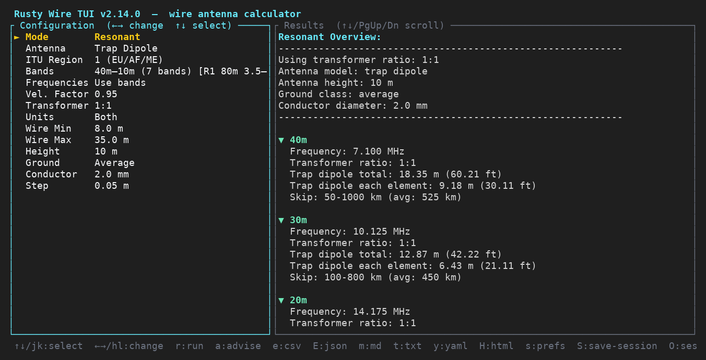
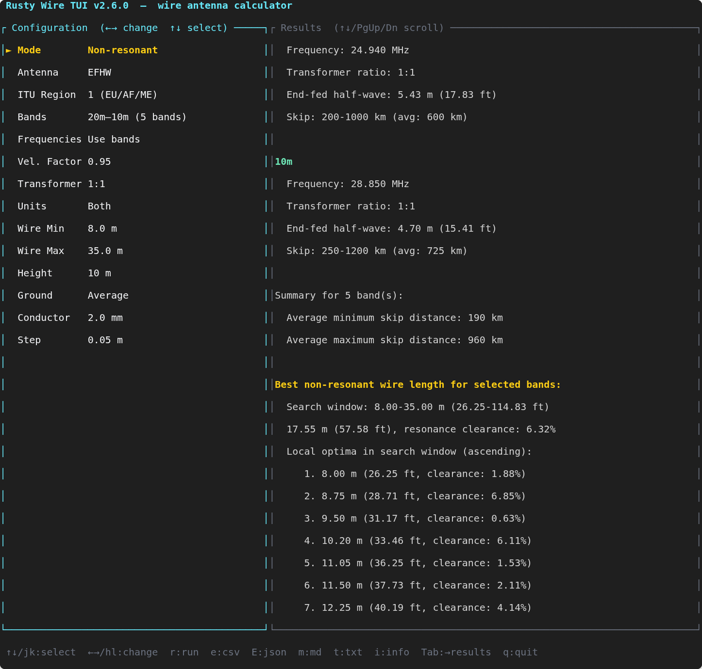
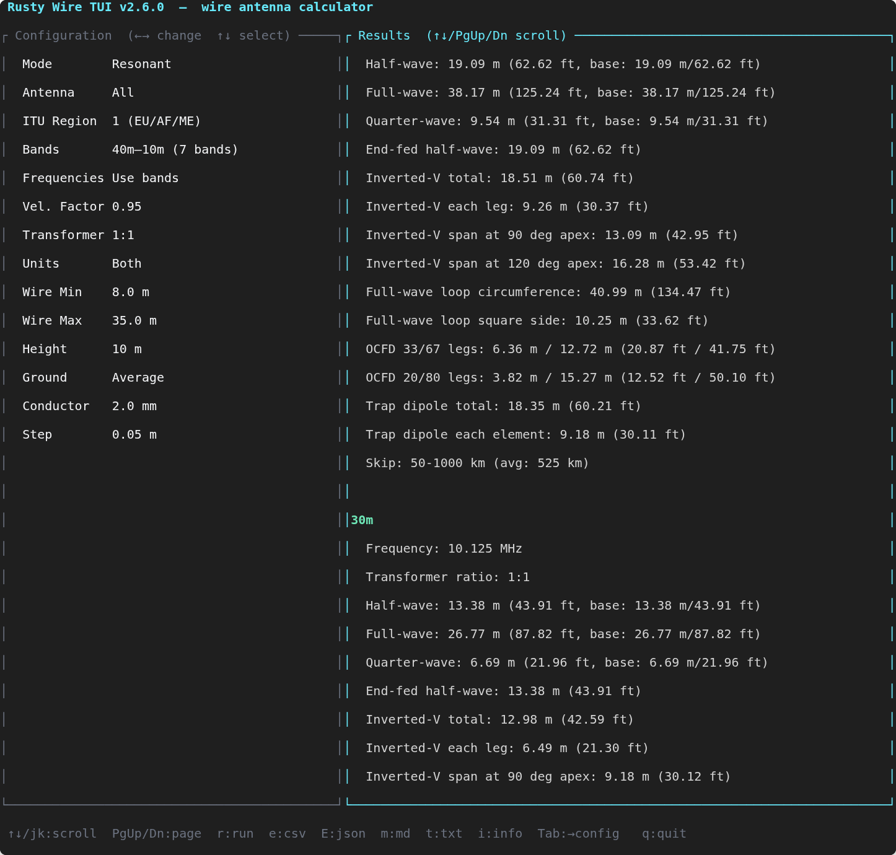

# CLI Guide

**Version 2.7.0**

Use this page as the command reference for Rusty Wire.

For test procedures, see [testing.md](testing.md).
For formulas and optimizer scoring details, see [math.md](math.md).
For architecture details, see [architecture.md](architecture.md).
For release history, see [CHANGELOG.md](CHANGELOG.md).

It supports:
- Resonant wire length calculations (half-wave, full-wave, quarter-wave)
- Derived antenna outputs for end-fed half-wave, full-wave loop, inverted-V dipole geometry, and off-center-fed dipole layouts
- Non-resonant common wire optimization across selected bands with multi-optima support
- Skip-distance summaries for selected bands
- Interactive and non-interactive (CLI) workflows
- ITU region-aware amateur band handling (Region 1/2/3)
- Multiple export formats: CSV, JSON, Markdown, and plain text
- Unit system filtering: metric-only, imperial-only, or both

## Features

- Band database with ham + shortwave bands
- Default band selection for quick use: a built-in multi-band preset (shown in `--help` and used when `--bands` is omitted)
- Calculation mode selection:
  - Resonant (default)
  - Non-resonant
- Velocity factor input (default: 0.95)
- Standardized antenna height presets (7 m, 10 m, 12 m)
- Ground-class modeling for skip estimates (poor, average, good)
- Additional resonant-model guidance:
  - End-fed half-wave total wire length
  - Full-wave loop circumference
  - Full-wave loop square-side estimate
  - OCFD leg split estimates (33/67 and 20/80)
  - Trap dipole total/per-element estimates with trap-frequency, placement, and pairing guidance notes
- Non-resonant search constraints in either meters (default) or feet
- Multiple local optima displayed for the active non-resonant search window
- Multiple equally-optimal wire lengths displayed in ascending order when ties occur
- Unit system awareness:
  - `--units m`: metric output only
  - `--units ft`: imperial output only
  - `--units both`: both systems (default when mixing unit inputs)
- Multiple export formats: CSV, JSON, Markdown, plain text
- Comma-separated export format selection: `--export csv,json,markdown,txt`

## Interactive Mode

Interactive mode is available explicitly:

```bash
rusty-wire --interactive
```

It lets you:
- List all available bands
- Select one or multiple bands, including named presets loaded from `bands.toml` or an alternate file passed via `--bands-config`
- Choose calculation mode (resonant or non-resonant)
- Set explicit frequencies as an alternative to band selection
- Set velocity factor
- Set standard antenna height (7 m / 10 m / 12 m)
- Set ground class (poor / average / good)
- Set conductor diameter in millimeters (1.0 to 4.0 mm)
- Choose transformer ratio
- Configure non-resonant wire windows interactively
- Export results as CSV (`e`), JSON (`E`), Markdown (`m`), or plain text (`t`) directly from the TUI

The TUI auto-discovers named presets from `~/.config/rusty-wire/bands.toml` first and `./bands.toml` second, adding them to the `Bands` field alongside the built-in preset list and the `Custom…` checklist option. To load a different preset file at startup, launch the TUI with `cargo run --bin tui -- --bands-config <path>` or `rusty-wire-tui --bands-config <path>`. Changing ITU region refreshes the built-in band preset labels and updates the custom-band checklist overlay in place.
Press `a` to toggle ranked advise candidates (wire + balun/unun ratio) in the results panel.

**TUI keybindings:**

| Key | Action |
|-----|--------|
| `↑` / `k` | Select previous config field |
| `↓` / `j` | Select next config field |
| `←` / `h` | Decrease selected field value |
| `→` / `l` | Increase selected field value |
| `r` / `Enter` | Run calculation |
| `a` | Toggle advise panel (ranked wire + balun/unun candidates) |
| `e` | Export results as CSV (`rusty-wire-results.csv`) |
| `E` | Export results as JSON (`rusty-wire-results.json`) |
| `m` | Export results as Markdown (`rusty-wire-results.md`) |
| `t` | Export results as plain text (`rusty-wire-results.txt`) |
| `i` / `?` | Toggle project info popup |
| `Tab` | Toggle focus between config and results panels |
| `PgUp` / `PgDn` | Scroll results (results panel focused) |
| `q` / `Esc` | Quit |

For TUI documentation screenshots (exact capture list and where to place each image), see [tui-screenshots.md](tui-screenshots.md).







### Interactive Mode: Per-Session Defaults

Starting with the next release, interactive mode remembers your last-used values for each prompt (bands, calculation mode, antenna model, velocity factor, transformer ratio, wire window, and units) during your session. When you repeat a calculation, prompts will pre-fill with your previous choices, making iterative planning much faster.

- To accept the previous value, just press Enter at the prompt.
- To change a value, type a new one as usual.
- Defaults reset when you exit and restart the program.

This feature applies to both multi-band and quick single-band calculations in interactive mode.

## CLI Usage


```bash
rusty-wire [OPTIONS]
```

From source:

```bash
cargo run -- [OPTIONS]
```

Interactive mode:

```bash
rusty-wire --interactive
```

## Core Options

- `--help` Show help
- `--info` Print project metadata (version, author, GitHub URL, license, platform)
- `--interactive` Start interactive mode
- `--list-bands` List bands for selected region
- `--region <1|2|3>` ITU region (default: `1`)
- `--bands <csv>` Band names/ranges, for example `40m,20m,10m-15m`
- `--bands-preset <name>` Named band preset loaded from TOML
- `--bands-config <path>` Preset config path override (otherwise auto-discovered from `~/.config/rusty-wire/bands.toml` then `./bands.toml`)
- `--advise` Print ranked wire + balun/unun candidates with efficiency-style metrics
- `--validate-with-fnec` With `--advise`, attempt optional fnec-rust cross-validation (if `fnec` is available in `PATH`) and print per-candidate status notes
- `--fnec-pass-max-mismatch <value>` With `--advise --validate-with-fnec`, mismatch factor at or below this value is marked `passed` (range `0.0..=1.0`, default `0.25`)
- `--fnec-reject-min-mismatch <value>` With `--advise --validate-with-fnec`, mismatch factor at or above this value is marked `rejected` (range `0.0..=1.0`, default `0.60`)
- `--mode <resonant|non-resonant>` Calculation mode (default: `resonant`)
- `--velocity <value>` Velocity factor, valid range `0.50..=1.00` (default: `0.95`)
- `--height <7|10|12>` Standard antenna height in meters used for height-aware skip estimates (default: `10`)
- `--ground <poor|average|good>` Ground class used in skip-distance scaling (default: `average`)
- `--conductor-mm <value>` Conductor diameter in millimeters, valid range `1.0..=4.0` (default: `2.0`)
- `--antenna <dipole|inverted-v|efhw|loop|ocfd|trap-dipole>` Filter output to one model (omit to show all)
- `--transformer <recommended|1:1|1:2|1:4|1:5|1:6|1:9|1:16|1:49|1:56|1:64>`
- `--units <m|ft|both>` Output unit filter
- `--step <meters>` Non-resonant search resolution (default: `0.05`)
- `--quiet` Suppress the results table; non-resonant prints one recommendation line, resonant exits silently. Useful for scripting.
- `--verbose` Print the resolved run configuration before executing
- `--dry-run` Validate inputs and print the resolved run without calculating or exporting
- `--freq <MHz>` Compute wire lengths for a single explicit frequency, bypassing band selection entirely (range: `0 < f ≤ 1000`)
- `--freq-list <f1,f2,...>` Compute wire lengths for multiple explicit frequencies in a single run (each produces a labelled row; range: `0 < f ≤ 1000` per value)
- `--velocity-sweep <v1,v2,...>` Run the same configuration at multiple velocity factors and print a side-by-side comparison table

## Non-Resonant Window Options

Only used with `--mode non-resonant`.

Metric:
- `--wire-min <meters>`
- `--wire-max <meters>`

Imperial:
- `--wire-min-ft <feet>`
- `--wire-max-ft <feet>`

Rules:
- Do not mix metric and imperial window flags in the same command.
- If `--bands` is omitted, Rusty Wire uses the built-in default band set.
- `--bands` and `--bands-preset` are mutually exclusive.

Preset file format:

```toml
[presets]
portable = ["40m", "20m", "15m", "10m"]
fieldday = ["80m", "40m", "20m", "15m", "10m"]
```

## Transformer Recommendation Defaults

`--transformer recommended` is the default. Current policy:

- Resonant + no specific model: `1:1`
- Non-resonant + no specific model: `1:9`
- Dipole / inverted-v / loop: `1:1`
- EFHW: `1:56`
- OCFD: `1:4`

You can always override with an explicit ratio.

## Export Options

- `--export <csv,json,markdown,txt>` One or more formats
- `--output <file>` Output path (single format uses this name; multiple formats use per-format filenames)
- Advise exports include validation metadata fields: `validated`, `validation_status`, and `validation_note`

Path safety:
- Absolute paths are rejected.
- Parent traversal with `..` is rejected.

## Region Notes

Modeled differences include:
- 80m: R1 `3.5-3.8`, R2 `3.5-4.0`, R3 `3.5-3.9`
- 40m: R1 `7.0-7.2`, R2 `7.0-7.3`, R3 `7.0-7.2`
- 60m: harmonized `5.3515-5.3665`

## Examples

Resonant run:

```bash
rusty-wire --mode resonant --bands 40m,20m --velocity 0.95
```

Non-resonant run with metric window:

```bash
rusty-wire --mode non-resonant --bands 40m,20m,10m --wire-min 10 --wire-max 35
```

Non-resonant run with feet window:

```bash
rusty-wire --mode non-resonant --bands 20m,15m --wire-min-ft 30 --wire-max-ft 90 --units ft
```

Antenna-specific resonant output:

```bash
rusty-wire --mode resonant --bands 40m,20m --antenna ocfd --transformer recommended
```

List regional bands:

```bash
rusty-wire --list-bands --region 2
```

Single explicit frequency:

```bash
rusty-wire --freq 7.074 --antenna dipole
```

Velocity sweep comparison:

```bash
rusty-wire --mode non-resonant --bands 40m,20m --wire-min 10 --wire-max 35 \
  --velocity-sweep 0.85,0.95,1.00
```

Named band preset from config:

```bash
rusty-wire --bands-preset portable
rusty-wire --bands-preset fieldday --bands-config ./profiles/bands.toml
```

Advise mode (ranked wire + balun/unun candidates):

```bash
rusty-wire --advise --bands 40m,20m,15m --antenna efhw
rusty-wire --advise --bands-preset portable --bands-config ./profiles/bands.toml
# Optional fnec-rust validation notes for top candidates
rusty-wire --advise --validate-with-fnec --bands 40m,20m --antenna efhw
# Export advise report as Markdown
rusty-wire --advise --bands 40m,20m --antenna efhw --export markdown --output advise.md
```

Script-friendly quiet output (non-resonant):

```bash
rusty-wire --mode non-resonant --bands 40m,20m --wire-min 10 --wire-max 35 --quiet
```

Verbose and dry-run inspection:

```bash
rusty-wire --bands 40m --verbose
rusty-wire --mode non-resonant --bands 40m,20m --wire-min 10 --wire-max 35 --dry-run
```

Finer search resolution:

```bash
rusty-wire --mode non-resonant --bands 80m --wire-min 6 --wire-max 30 --step 0.01
```

Export multiple formats:

```bash
rusty-wire --mode non-resonant --bands 20m,10m-15m --export csv,json,markdown --output results
```

SBOM commands:

```bash
cargo sbom
cargo sbom-cdx
```

### 8) Imperial-only output and export

```bash
rusty-wire --mode non-resonant --bands 20m,10m --wire-min-ft 30 --wire-max-ft 60 --units ft --export markdown,txt
```

### 9) View multiple optima in non-resonant mode

```bash
rusty-wire --mode non-resonant --bands 80m --velocity 0.50 --wire-min 6 --wire-max 30
```

Non-resonant mode displays local optima for the active search window and, when present, equal-tie optima:
```
Best non-resonant wire length for selected bands:
  15.00 m (49.21 ft), resonance clearance: 33.33%
  Local optima in search window (ascending):
     1. 10.35 m (33.96 ft, clearance: 3.95%)
     2. 15.00 m (49.21 ft, clearance: 33.33%, recommended)
     3. 19.65 m (64.47 ft, clearance: 18.32%)
  Additional equal optima in range (ascending):
     1. 15.00 m (49.21 ft, clearance: 33.33%)
     2. 25.00 m (82.02 ft, clearance: 20.00%)
```

## Output Summary

### Resonant mode includes:
- Per-band resonant lengths (with optional unit system filtering)
- Skip-distance summary
- **Resonant points within the active search window** (quarter-wave harmonics for selected bands)
- **Closest combined compromises to resonant points** (multiple near-best shared lengths across selected bands)
- Multiple export format support (CSV, JSON, Markdown, plain text)

### Non-resonant mode includes:
- Band context overview
- Skip-distance summary
- **Best non-resonant wire length** with search window and resonance clearance
- **Local optima in the active search window** in ascending order
- **Multiple equally-optimal wire lengths** in ascending order (if ties exist)
- Multiple export format support (CSV, JSON, Markdown, plain text)

## Testing

### Running the multi-optima test script

Rusty Wire includes a comprehensive test script to verify that the multi-optima feature works correctly:

```bash
./scripts/test-multi-optima.sh
```

This script:
- Builds the project
- Performs an exhaustive parameter sweep across:
  - Band combinations (1–10 + multi-band selections)
  - Velocity factors (0.50–1.00 in 0.05 steps)
  - Wire length windows (various metric ranges)
- Exits on first non-resonant calculation that produces multiple optima
- Prints the discovered case and example output
- Returns exit code 0 on success, 1 if no multi-optima found

**Environment variables:**
- `BIN` — Path to the compiled binary (default: `target/debug/rusty-wire`)
- `SWEEP_OUT` — Path for sweep results file (default: `/tmp/sweep_out.txt`)

**Example output:**
```
FOUND_MULTIPLE
bands=2 vf=0.50 min=6 max=30
Best non-resonant wire length for selected bands:
  15.00 m (49.21 ft), resonance clearance: 33.33%
  Additional equal optima in range (ascending):
     1. 15.00 m (49.21 ft, clearance: 33.33%)
     2. 25.00 m (82.02 ft, clearance: 20.00%)

PASS: multi-optima behavior is reachable.
```

### Running the ITU region regression script

```bash
./scripts/test-itu-region-bands.sh
```

This script:
- Builds the project
- Runs `--list-bands` for Regions 1, 2, and 3
- Verifies all listed bands and ranges against expected values
- Returns exit code 0 on success, non-zero on mismatch

## Error Handling and Validation

All user input and configuration validation is performed in the app layer and returns structured errors via the `AppError` enum. This ensures:
- Consistent error messages for CLI and future UIs
- Centralized validation logic for all user-facing input
- Comprehensive test coverage for all error cases

See the source and tests in `src/app.rs` for details.
